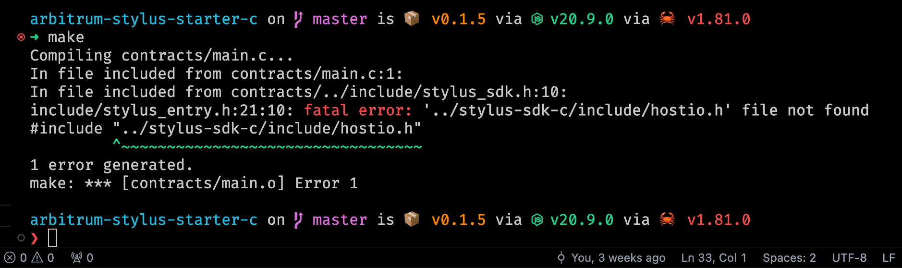

# Arbitrum Stylus Starter Template for C

---

## Requisitos

- Brew (Mac) / Chocolatey (Windows)
- Docker (Docker Desktop)
- rust, cargo y rustup
- LLVM (con wasm-ld): Disponible desde la versión 15 (`llvm@15`)

## Verificar si tenemos `wasm-strip` instalado

Si no, podemos instalarlo con `brew install wabt`

## Instalando Cargo Stylus

- fork / git clone de este repositorio
- `git submodule update --init --recursive`
- `cargo install cargo-stylus`
- `rustup target add wasm32-unknown-unknown` (**opcional**, solventa un error de target wasm32 not found al hacer make)

## Validar entorno de desarollo

- `make` para generar el archivo contract.wasm
- `cargo stylus check --wasm-file ./contract.wasm -e https://sepolia-rollup.arbitrum.io/rpc` (si tenemos output en verde estamos listos 🚀🚀)

---

> [!TIP]
> Cuando veamos este error significa que no hemos inicializado los modulos de git. Lo solventamos haciendo `git submodule update --init --recursive`

---

## Notas para el desarrollador

### Register and Storage Slots

Storage slots are pretty similar to registers in 32bit architectures.
Since both have:

1. Fixed Size: Storage slots in Ethereum can hold exactly 32 bytes. Similar to how registers have a fixed size in assembly (e.g., 32-bit, 64-bit).

2. Direct Addressing: Just as you access a specific register by its identifier (eax, r1), you access storage slots using their indexes: 0x01, 0x02.

3. Explicit Management: Like assembly programming, developers must explicitly manage how storage slots are allocated and used. Miss assignment of memory/slots can cause data corruption.

Leer más [A gentle introduction: Stylus](https://docs.arbitrum.io/stylus/gentle-introduction)
